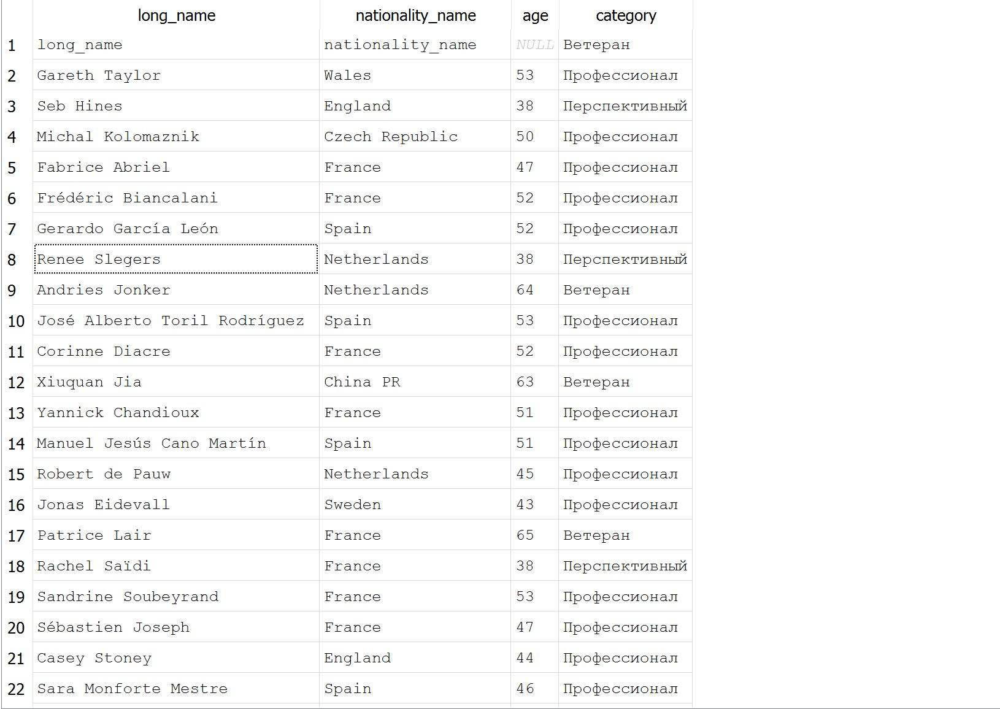

# Female Football Coaches Demographics Analysis (SQL)

## Project Overview
This project focuses on analyzing a dataset of football coaches using **SQL (SQLite)**. The goal was to clean the raw data, perform exploratory data analysis (EDA), and extract meaningful insights regarding coach demographics across different nations.

## Tech Stack
* **Database:** SQLite
* **Tool:** DB Browser for SQLite
* **Language:** SQL

## Database Schema & Data Cleaning
The initial dataset contained some missing values in birth dates and image URLs.
* **Handled Missing Data:** Filtered out records without `dob` (Date of Birth) for age-related analytics.
* **Data Transformation:** Converted string dates into calculated age values using SQL date functions.

## Key Insights & Queries
### 1. National Representation and Average Age
I analyzed which countries have the most coaches in the dataset and calculated the average age per nation to identify "younger" vs "older" coaching schools.

### 2. Career Stage Segmentation
Using `CASE` statements, I categorized coaches into three groups:
* **Young Prospect:** Under 40 years old.
* **Mid-Career:** 40 - 55 years old.
* **Veteran:** 55+ years old.

## How to Run
1. Download the `female_coaches.csv` from the `data/` folder.
2. Import it into DB Browser for SQLite.
3. Run the script located in `scripts/analysis_queries.sql`.

## Conclusions
* Spain and France show a higher concentration of younger coaching staff.
* Data quality check revealed that ~20% of records lack exact birth dates, which was accounted for in the final report.